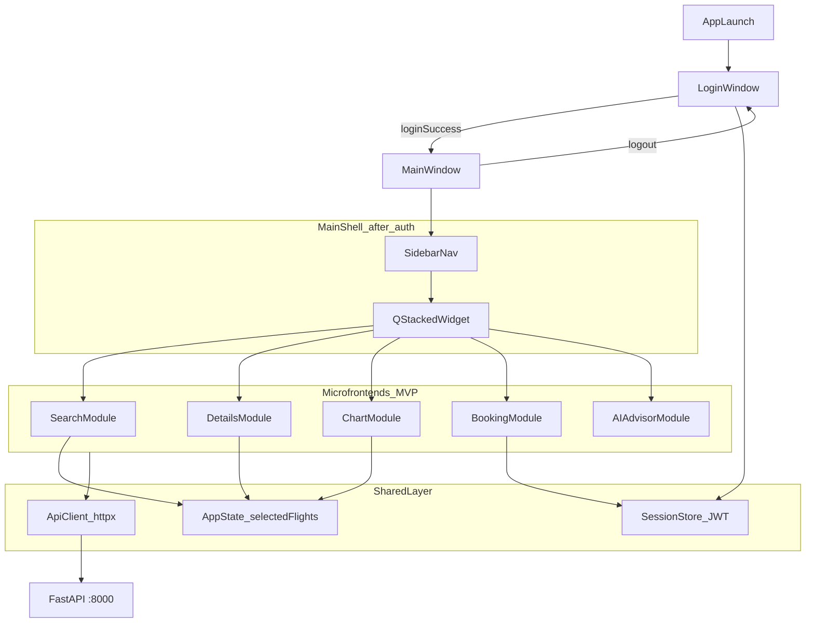

# PySide6 Front-end Build Plan

## Context and constraints

The backend is ready at `http://127.0.0.1:8000` ([README.md](c:\Users\Admin\Desktop\flight-assistant\README.md)). The front must talk to it **only via HTTP/JSON** — never touch Postgres directly.

**Important API realities to design around:**

| PRD expectation | Actual backend today |
|---|---|
| Search by origin, destination, and date | `GET /flights?dep_iata=...&limit=...` only — no `arr_iata` or date params ([flights.py](c:\Users\Admin\Desktop\flight-assistant\back\app\api\queries\flights.py)) |
| Chart by price or schedule | `Flight` has schedule, delay, airline, status — **no price field** ([models.py](c:\Users\Admin\Desktop\flight-assistant\back\app\models.py)) |

Plan the Search UI with origin + limit for now; optionally add destination/date fields as **client-side filters** on results until the backend extends the query. Build ChartModule around **departure delay or count-by-airline/status**, not price.

---

## Architecture overview

The app uses a **two-stage window flow**: Login screen first, main app second.



**Login is not a sidebar page** — it is the entry gate. After auth, the user lands in MainWindow (default page: Search). A **Logout** button in the sidebar or header returns to the login screen and clears the session.

**MVP contract (same for every module):**

- **View** (`view.py`): PySide6 widgets only. Exposes Qt signals for user actions (`searchClicked`, `flightSelected`, …). No HTTP, no business rules.
- **Presenter** (`presenter.py`): Subscribes to View signals, calls Model/API, updates View state, shows errors. Holds no widget references beyond the View interface.
- **Model** (`model.py`): Dataclasses mirroring backend Pydantic shapes + thin methods that delegate to the shared API layer. Keeps module-specific state (e.g. last search results).

Shared **API client** lives outside modules so presenters stay thin.

---

## Phase 0 — Project setup (do this first)

### 0.1 Environment

- Create [`front/`](c:\Users\Admin\Desktop\flight-assistant\front) with its own venv.
- Use **Python 3.12 or 3.13** (PRD note: PySide6 may break on 3.14).
- [`front/requirements.txt`](c:\Users\Admin\Desktop\flight-assistant\front\requirements.txt): `PySide6`, `httpx` (async-ready; sync client is fine for MVP).

### 0.2 Folder layout

```
front/
  app/
    main.py              # QApplication entry
    config.py            # BASE_URL = http://127.0.0.1:8000
    api/
      client.py          # httpx wrapper, error mapping, optional Bearer header
      auth.py
      flights.py
      bookings.py
      advisor.py
    domain/
      models.py          # Flight, Booking, Token, AdvisorAnswer, … (dataclasses)
    shared/
      session.py         # in-memory JWT + is_authenticated()
      app_state.py       # selected flight, last search results (Qt signals optional)
    shell/
      login_window.py    # first screen on startup
      main_window.py     # sidebar + QStackedWidget (shown after login)
      sidebar.py
    modules/
      search/   { view.py, presenter.py, model.py }
      details/  { ... }
      chart/    { ... }
      login/    { ... }
      booking/  { ... }
      advisor/  { ... }
  requirements.txt
  README.md              # how to run: python -m app.main
```

### 0.3 Shared API client

Implement once in [`front/app/api/client.py`](c:\Users\Admin\Desktop\flight-assistant\front\app\api\client.py):

- `get(path, params)` / `post(path, json)` using `httpx`
- Inject `Authorization: Bearer <token>` when `session.token` is set
- Map `httpx.HTTPStatusError` → user-facing strings (401 → “Please log in”, 404 → “Not found”, etc.)
- Health check: `GET /health` on startup (optional status indicator in shell)

Mirror backend types from [`back/app/models.py`](c:\Users\Admin\Desktop\flight-assistant\back\app\models.py) in `domain/models.py`.

Validate Phase 0: venv, imports, API client, and domain models work; health check succeeds with backend running.

---

## Module build order

Build in this order — each step adds a working slice you can demo before moving on.

### 1. LoginModule (startup gate — build immediately after Phase 0)

**Why first:** The app opens on a login screen. No main shell is shown until the user authenticates.

| Layer | Responsibility |
|---|---|
| View | Centered login form: email + password, **Login** and **Register** buttons, error label, loading state |
| Presenter | On login/register: call API, store JWT + email in `Session`, emit `loginSucceeded` signal |
| Model | `register(email, pwd)`, `login(email, pwd) -> Token` |

**API:**

- `POST /auth/register` → 201
- `POST /auth/login` → `{ access_token }`

**Shell wiring** in [`front/app/main.py`](c:\Users\Admin\Desktop\flight-assistant\front\app\main.py):

1. Create `QApplication`
2. Show `LoginWindow` (not MainWindow)
3. On `loginSucceeded` → hide/close LoginWindow, create and show `MainWindow`
4. On logout from MainWindow → close MainWindow, clear `Session`, show LoginWindow again

**Acceptance:** App launch shows login only; successful login opens main app; logout returns to login; invalid credentials show an error without opening main shell.

**Note:** Backend flight/advisor endpoints are public, but gating the whole app behind login matches the PRD’s “simple auth” requirement and keeps Booking ready without extra guards.

---

### 2. Main shell (empty stack — after Login works)

Build [`front/app/shell/main_window.py`](c:\Users\Admin\Desktop\flight-assistant\front\app\shell\main_window.py):

- Left **sidebar** with nav items: Search, Details, Chart, Advisor, Bookings — plus **Logout** at the bottom
- Show logged-in user email in sidebar header
- Right **QStackedWidget** — one page per module (no Login page in stack)
- Default page on open: **Search**
- **AppState** passed into presenters that need cross-module data
- Disable nav items that need prerequisites (e.g. Details disabled until a flight is selected)

Validate: login → main shell opens; sidebar switches placeholder pages; logout returns to login.

---

### 3. SearchModule

**Why third:** First functional module inside the main shell; feeds Details and Chart.

| Layer | Responsibility |
|---|---|
| View | `QLineEdit` dep IATA, `QSpinBox` limit, Search button, `QTableWidget` or `QListWidget` of results (flight number, airline, dep→arr, status) |
| Presenter | On search: validate IATA (3 letters), call API, populate table, emit/store selection |
| Model | `search(dep_iata, limit) -> list[Flight]` via `GET /flights` |

**API:** `GET /flights?dep_iata={code}&limit={n}`

**Acceptance:** Search for `JFK` shows rows; selecting a row writes `AppState.selected_flight` and enables Details nav.

**Note:** Be mindful of AviationStack’s 100 req/month quota (called out in README).

---

### 4. DetailsModule (depends on Search selection)

**Why fourth:** Fulfills course req 3.2; can also refresh a flight by number.

| Layer | Responsibility |
|---|---|
| View | Labels for airline, flight number, status, date; dep/arr blocks (airport, time, terminal, gate, delay) |
| Presenter | Load from `AppState.selected_flight`; optional “Refresh” calls `GET /flights/{flight_iata}` |
| Model | `get_details(flight_iata) -> Flight` |

**API:** Prefer cached selection; refresh via `GET /flights/{flight_iata}`

**Acceptance:** Selecting a search result and opening Details shows full flight info; Refresh updates status/delay.

---

### 5. ChartModule (depends on Search results)

**Why fifth:** Course req 3.3; needs a list of flights to visualize.

| Layer | Responsibility |
|---|---|
| View | `QtCharts.QChartView` (bar chart recommended for MVP) |
| Presenter | Aggregate `AppState.search_results` — e.g. count per airline, or average departure delay per airline |
| Model | Pure aggregation functions on `list[Flight]` (no extra API call required) |

**Suggested charts (no backend change):**

- Bar: flight count by airline
- Bar: average `departure.delay` by airline (treat `None` as 0)

**Acceptance:** After a search, Chart page renders at least one meaningful chart from current results.

---

### 6. BookingModule (depends on Login + ideally Details)

**Why sixth:** Course req 3.5; user is already authenticated at app entry; needs a flight number.

| Layer | Responsibility |
|---|---|
| View | Form: passenger name, flight number (pre-filled from selected flight), Create button; table of user bookings; Confirm/Cancel buttons per row |
| Presenter | Gate actions on `session.is_authenticated()`; refresh list after commands |
| Model | CRUD wrappers for booking endpoints |

**API:**

- `GET /bookings` — list
- `GET /bookings/{id}` — detail (optional drill-down)
- `POST /bookings` — body: `{ flight_number, passenger_name }`
- `POST /bookings/{id}/confirm` / `cancel`

**Acceptance:** Authenticated user creates booking from selected flight, sees it in list, can confirm and cancel; 401 (expired token) triggers logout back to login screen.

Optional stretch: `GET /bookings/{id}/history` in a dialog to demonstrate event sourcing visibility.

---

### 7. AIAdvisorModule (independent — build last)

**Why last:** No dependency on other modules; RAG calls can be slow (60s timeout in gateway). Easier to polish once shell and error handling exist.

| Layer | Responsibility |
|---|---|
| View | Question `QTextEdit`, Ask button, answer area, sources list |
| Presenter | Disable Ask while loading; show answer + sources on success |
| Model | `ask(question) -> AdvisorAnswer` |

**API:** `POST /advisor` — body: `{ question }` → `{ answer, sources }`

**Acceptance:** Sample questions (“What is a connection?”, “Baggage rules?”) return answers with source filenames from `knowledge_base/`.

---

## Cross-module data flow

```mermaid
sequenceDiagram
    participant User
    participant Login as LoginPresenter
    participant Shell as MainWindow
    participant Search as SearchPresenter
    participant State as AppState
    participant Details as DetailsPresenter
    participant Chart as ChartPresenter
    participant Booking as BookingPresenter

    User->>Login: email + password
    Login->>Login: session.token = JWT
    Login->>Shell: loginSucceeded → show MainWindow
    User->>Search: dep_iata + Search
    Search->>State: set search_results
    User->>Search: select row
    Search->>State: set selected_flight
    User->>Details: open Details page
    Details->>State: read selected_flight
    User->>Chart: open Chart page
    Chart->>State: read search_results
    User->>Booking: create booking
    Booking->>State: read selected_flight.flight_number
    Booking->>Booking: POST /bookings with Bearer
    User->>Shell: logout
    Shell->>Login: clear session → show LoginWindow
```

---

## MVP pattern checklist (per module)

When implementing each module, follow this sequence:

1. **Define domain types** in `domain/models.py` if not already present.
2. **Write Model** — one class with methods that call `api/*.py` and return typed objects.
3. **Build View** — layout + signals only; include loading/disabled states and a `QLabel` for errors.
4. **Write Presenter** — connect signals in `__init__`; never import Qt widgets except through the View.
5. **Register in shell** — add sidebar item, stack page, wire presenter with shared `AppState` / `Session`.
6. **Validate** — manual test against running backend + Docker (Postgres, Ollama for Advisor).

---

## Suggested validation order (PIV loop from PRD)

After each step, verify before proceeding:

1. **Login** — app opens on login screen; register + login opens main shell; logout returns to login
2. **Shell** — sidebar navigation works; user email shown; default page is Search
3. **Search** — `dep_iata=TLV`, results render
4. **Details** — selection shows TLV flight details
5. **Chart** — chart updates after search
6. **Booking** — full create → confirm → cancel cycle (token already in session)
7. **Advisor** — question returns answer (Ollama containers running)

---

## Out of scope for initial MVP (defer to milestone 6)

- Real payment, multi-language UI (PRD section 5)
- Cloudinary, somee.com migration
- Polished styling/theming beyond basic layouts
- Automated front tests (add after manual PIV passes)

Update [README.md](c:\Users\Admin\Desktop\flight-assistant\README.md) `front/` line from “not started yet” once Phase 0 lands.
